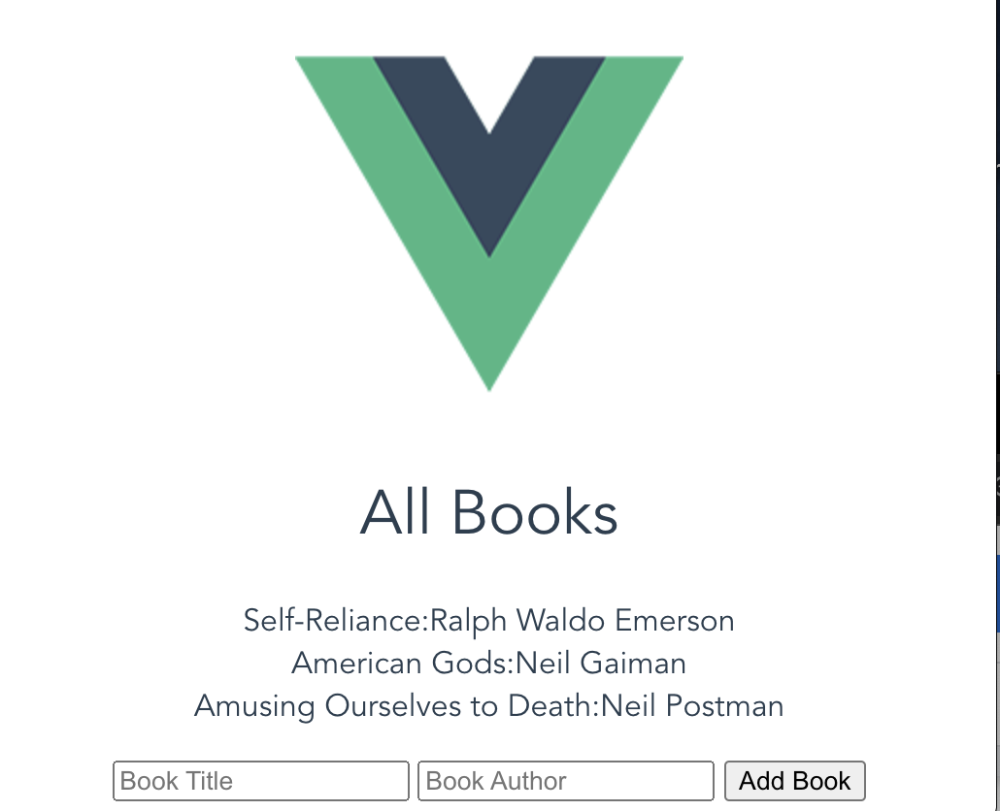

# Build a Reading List Application with Vue.js

This repo contains the code for the 2018 [Pluralsight Project](https://app.pluralsight.com/projects/build-a-reading-list-application-with-vue-js) "Build a Reading List Application with Vue.js"

This Project was created with Vue 2.5.

I cloned the repo and built it following instructions. I then ran tests to see if what I built met their specifications.

As it'd been a while, this project was a review to see what I remembered of Vue, Oct 2021.

 

<!-- [Second Part](https://app.pluralsight.com/projects/add-features-with-forms-to-a-vue-js-reading-list-application/setup/a7fe7125-9050-4c2f-bd8f-ffe1fdf65070) -->

## Installation Instructions and Verifying Local Environment

### Installation

Run the following command from root folder of the forked project to install all dependencies.

```
npm install
```

### Verify Setup

In order to verify that everything is setup correctly, run the following command that should show you the failing tests.

```
npm run test
```

This is good! We'll be fixing these tests once we jump into the build step. Every time you want to check your work locally you can type that command and it will report the status of every task in the project.  In addition, each module has tests that can be run scoped to just the tasks in that module.  See the instructions at the top of each list of tasks for more information.

### Previewing Your Work

In order to see your changes in a browser, you can type this to start the application.

```
npm run dev
```

Then, when you visit http://localhost:8080 in a browser you should see the App.vue component's HTML and CSS rendered on the page.